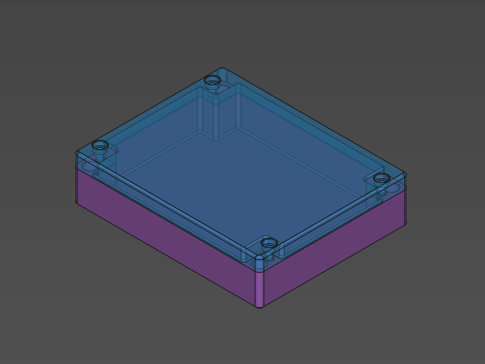
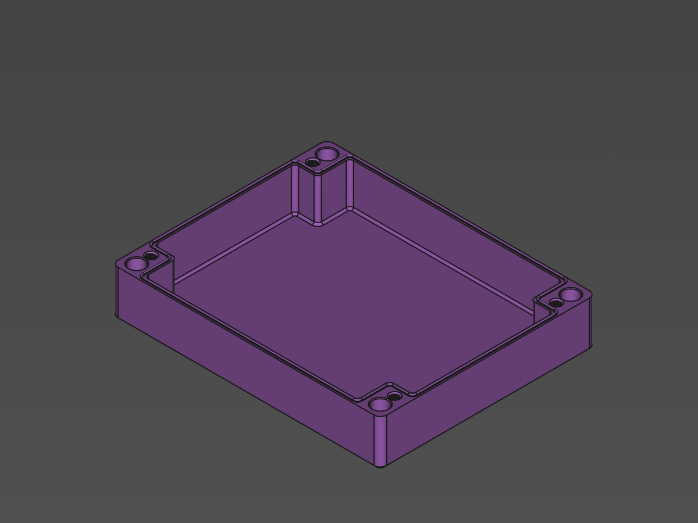
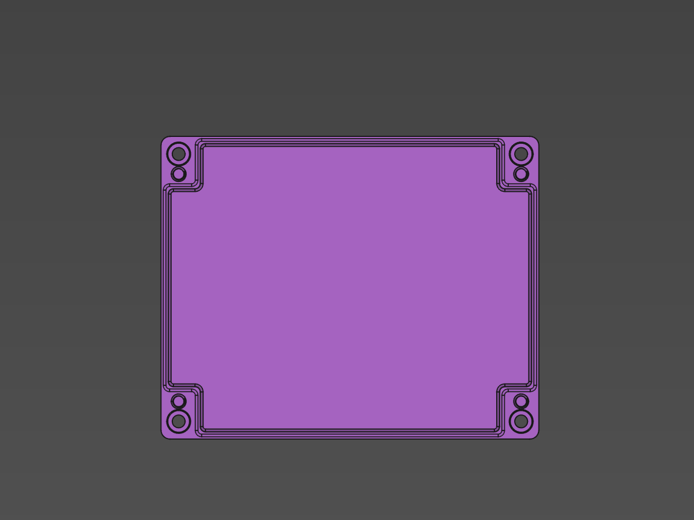
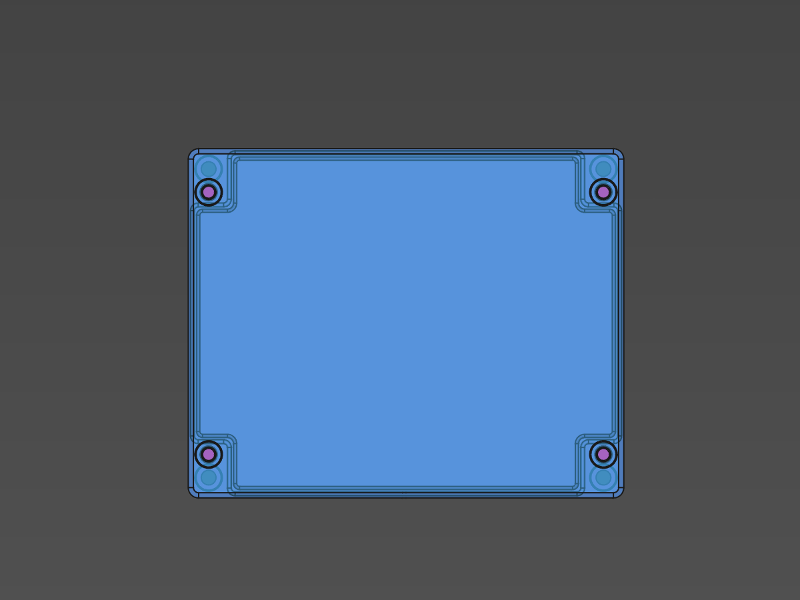
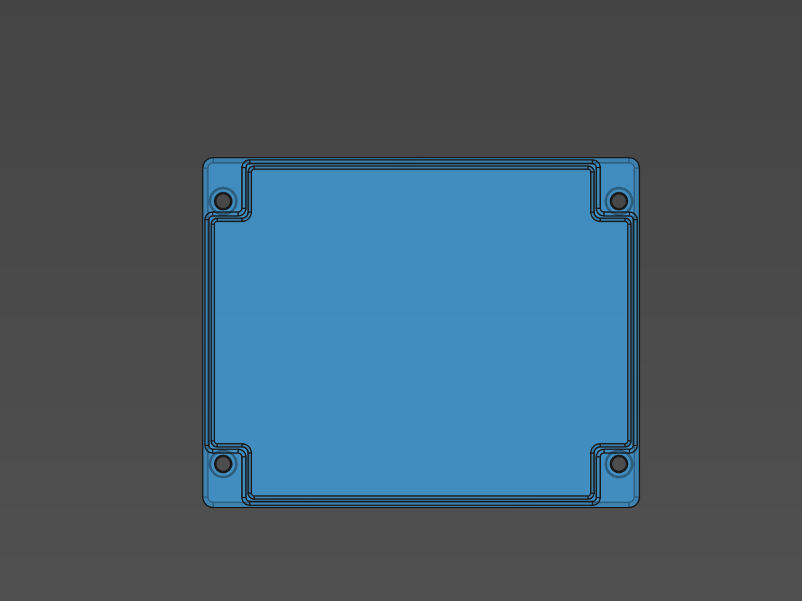
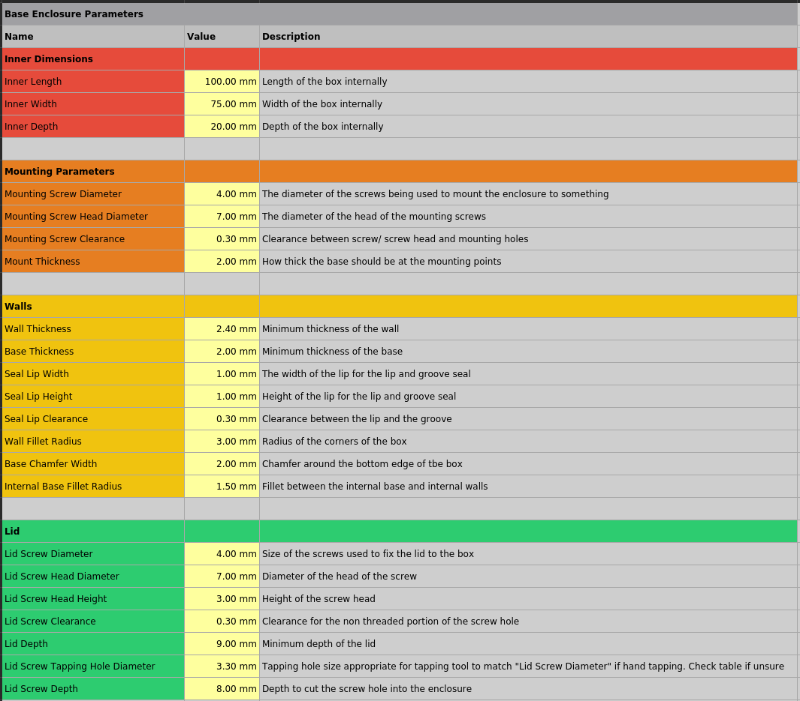

# Parametric Enclosure Base
Parametric Electronics Enclosure made in FreeCAD

This enclosure serves as a base to most of the electronics enclosures I create.
(Requires FreeCAD 0.19 & Fasteners Workbench addon for tapped holes)

*Enclosure Base and Lid*

*Enclosure Base*

*Enclosure Base*

*Enclosure Base and Lid*

*Enclosure Lid*

Edit the parameters in the FreeCAD spreadsheet to get the correct size for the enclosure, then add any additional features required.

*Parameter Spreadsheet*
